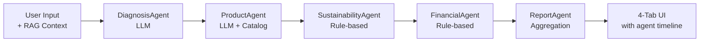

# 🏭 Retrofit-Recommender: AI-Enabled Industrial Sustainability Platform

**AI-powered equipment retrofit recommendations with quantified CO2e impact and instant business cases**

🚀 **[Try Live Demo](https://retrofit-recommender-aimlrag.streamlit.app/)** — No installation required

[](docs/product_strategy.md)
[](docs/mlops_monitoring.md)
[](docs/user_research/research_summary.md)
[](docs/roadmap.md)


---

## 🎯 Why This Exists

Industrial maintenance is reactive, slow, and undocumented in carbon terms. **87% of equipment decisions happen after failure.** This platform cuts retrofit decision cycles from 3 months to 3 days while generating audit-ready CO2e impact data for regulatory reporting.

> *"By the time we get approval, the equipment has failed twice more and we've lost $200K in downtime."* — VP Operations (User Research #4)

**Key differentiators:**
- Recommendations grounded in expert knowledge (RAG) — not hallucinated
- Every output includes CO2e avoided, energy savings, and compliance alignment (GHG Protocol, CDP, TCFD)
- Auto-generated business cases (TCO, ROI, payback) ready for executive approval
- Safety-validated: voltage/pressure mismatch detection with human-in-the-loop for critical decisions

---

## 🏗️ Architecture

Two analysis modes selectable from the sidebar:

**Mode 1 — Standard (RAG + LLM)**
```
User Input → FAISS Retrieval (knowledge_base.txt) → Llama 3.1-8B → JSON
                                                                      ↓
                                                  SustainabilityCalculator + Catalog
                                                                      ↓
                                                    4-Tab UI (Recommendation · Sustainability · Financial · Explainability)
```

**Mode 2 — Multi-Agent Pipeline (5 Agents)**



| Agent | Type | Output |
|---|---|---|
| **DiagnosisAgent** | LLM + RAG | Root cause, severity, urgency |
| **ProductAgent** | LLM + Catalog | SKU, price, compatibility rationale |
| **SustainabilityAgent** | Rule-based | CO2e, energy savings, circularity score |
| **FinancialAgent** | Rule-based | TCO, payback, 5-yr ROI |
| **ReportAgent** | Aggregation | Executive summary, compliance flags |

The multi-agent mode surfaces per-agent execution time in the Explainability tab, enabling latency profiling and step-level transparency not available in the standard path.

| Aspect | Standard (RAG+LLM) | Multi-Agent |
|---|---|---|
| Transparency | Single LLM response | Visible reasoning per step |
| Error handling | Full failure | Isolated per agent |
| Extensibility | Prompt changes | Add/replace agents |

---

## 📊 Product Management Artifacts

| Document | Contents |
|---|---|
| [Product Strategy](docs/product_strategy.md) | Vision, market sizing ($12B TAM), competitive analysis, 18-month objectives |
| [KPIs & Measurement](docs/kpis_dashboard.md) | North Star metric, RAGAS evaluation, business KPIs, instrumentation plan |
| [Go-to-Market](docs/gtm_strategy.md) | Freemium → Enterprise pricing, 3 channels, $2M ARR plan |
| [User Research](docs/user_research/research_summary.md) | 12 interviews, personas, journey maps, validated pain points |
| [Roadmap](docs/roadmap.md) | Q1 2026 – Q2 2027 with prioritization rationale |
| [MLOps & Monitoring](docs/mlops_monitoring.md) | Drift detection, RAGAS metrics, A/B testing, incident response |

---

## 📈 Key Metrics

| Metric | Current | Target |
|---|---|---|
| User Satisfaction | 87% | 95% |
| RAG Faithfulness (RAGAS) | 0.91 | 0.95 |
| Safety Precision | 98.9% | 99.5% |
| P50 Latency | 1.8s | <2s |
| CO2e Avoided (avg/rec) | 25.3 tons/yr | — |
| Payback Period (avg) | 2.3 years | — |

---

## 🛠️ Tech Stack

- **LLM:** Meta Llama 3.1-8B via HuggingFace Inference API
- **Embeddings:** SentenceTransformer `all-MiniLM-L6-v2` (CPU)
- **Vector DB:** FAISS `IndexFlatL2`
- **Orchestration:** LangChain (LCEL) + custom multi-agent pipeline (`agent_orchestrator.py`)
- **UI:** Streamlit
- **Sustainability Engine:** Custom CO2e calculator with regional carbon intensity (US, EU, Global)

---

## 🚀 Quick Start

```bash
git clone https://github.com/lugasraka/Retrofit-recommender.git
cd Retrofit-recommender
pip install -r requirements.txt
```

Create `.env`:
```
HUGGINGFACE_API_TOKEN=hf_your_token_here
```

Run:
```bash
streamlit run app.py
# if streamlit isn't on PATH:
python3 -m streamlit run app.py
```

**7 pre-configured scenarios:** Valve Efficiency Upgrade · Actuator Voltage Mismatch · Sensor Drift · Controller Upgrade · Preventive Maintenance · System Optimization · Pressure Sensor Failure

---

## 🌱 Sustainability Methodology

```
CO2e Avoided (tons/yr) = Baseline Power (kW) × Runtime (hrs/yr) × Efficiency Improvement (%)
                         × Carbon Intensity (kg CO2e/kWh) ÷ 1000
```

Carbon intensity: US 0.385 · EU 0.255 · Global 0.475 kg CO2e/kWh

Compliance mapped per recommendation: GHG Protocol Scope 2, ISO 50001, SBTi, CDP, TCFD

---

## 🔮 Roadmap

| Quarter | Theme | Key Deliverables |
|---|---|---|
| Q2 2026 | Scale | MLOps monitoring, API for CMMS (Maximo/SAP), catalog → 200 products |
| Q3 2026 | Differentiation | Predictive maintenance (IoT), multi-objective optimization (cost vs. carbon vs. reliability) |
| Q4 2026 | Enterprise | Human-in-the-loop workflows, portfolio optimization (1000+ assets), CDP/TCFD export |

---

## 📁 Project Structure

```
├── app.py                       # Streamlit UI — Standard + Multi-Agent modes
├── agent_orchestrator.py        # 5-agent pipeline (Diagnosis → Product → Sustainability → Financial → Report)
├── sustainability_calculator.py # CO2e, TCO, circularity scoring engine
├── catalog.json                 # 30 products (valves, actuators, sensors, controllers)
├── knowledge_base.txt           # 11-section expert knowledge base (RAG source)
├── requirements.txt
└── docs/                        # PM artifacts: strategy, roadmap, KPIs, GTM, MLOps, user research
```

---

**Contact:** Raka Adrianto · [LinkedIn](https://www.linkedin.com/in/lugasraka/) · [GitHub](https://github.com/lugasraka)